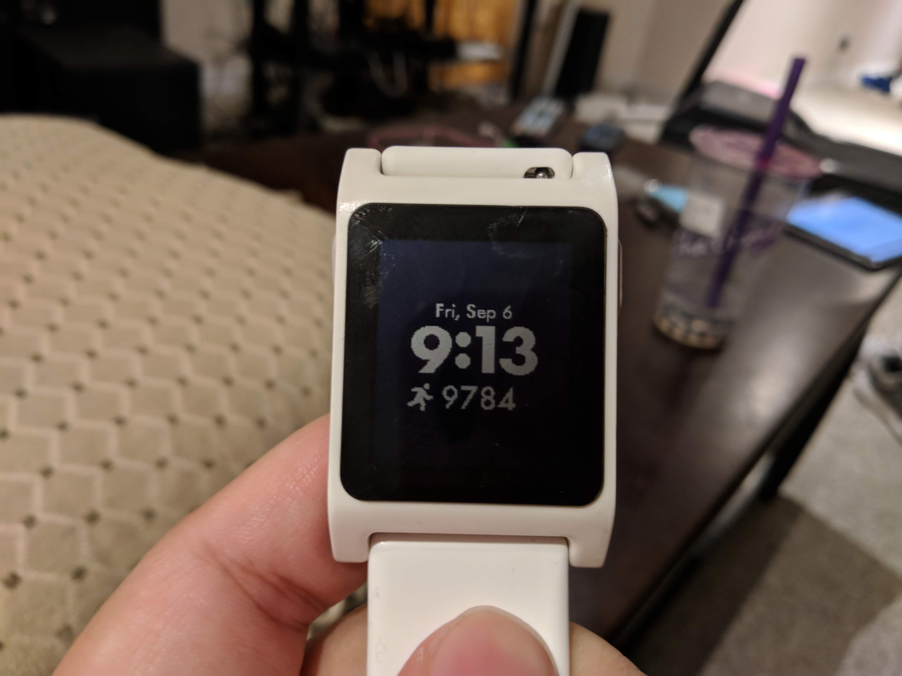
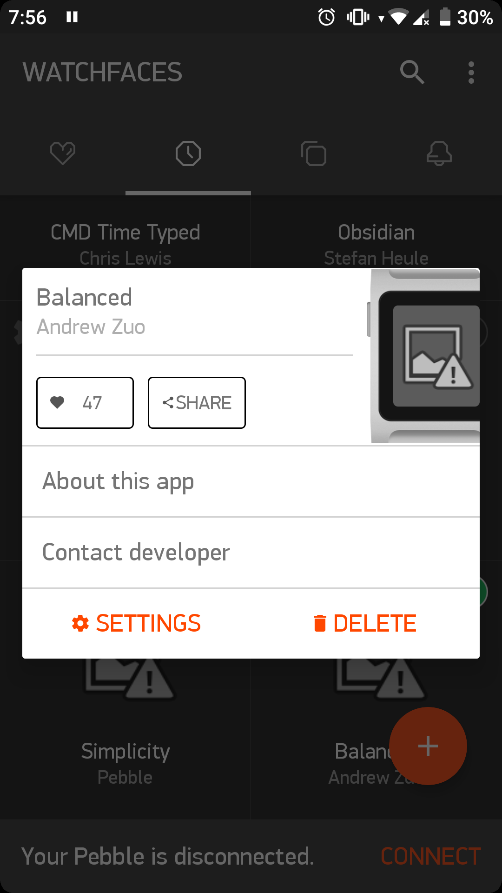
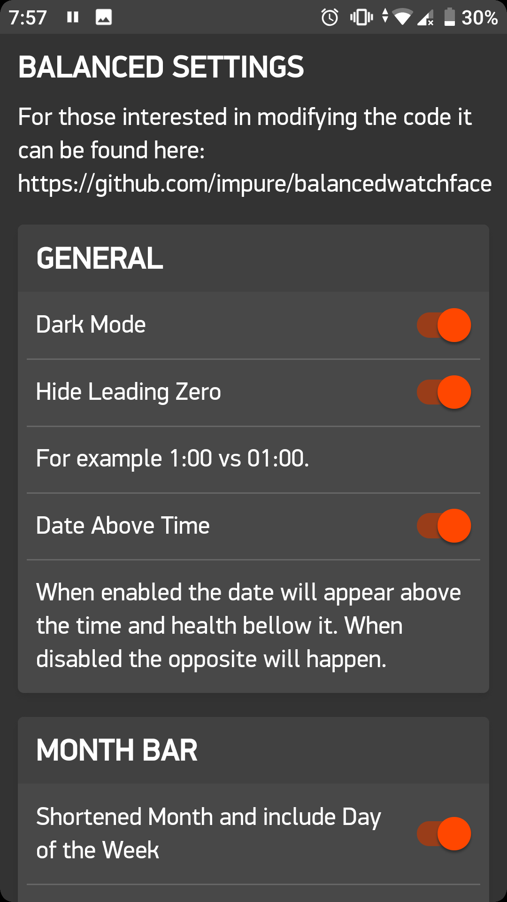
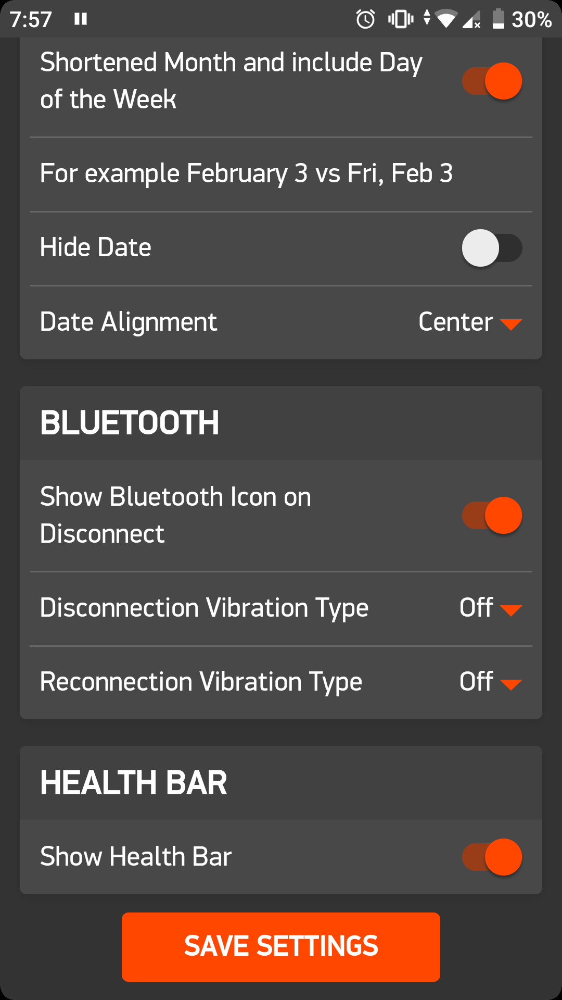

# Balanced Watchface

This is a watchface for the (now defunct) Pebble smartwatch.

It has a very simple UI featuring a custom font based on Futura. The reason I developed this watchface was due to not seeing any sufficiently minimal watchface in the Pebble app store.

In addition the watchface also has several settings that could be adjusted in the app. The settings use a framework called Clay.

